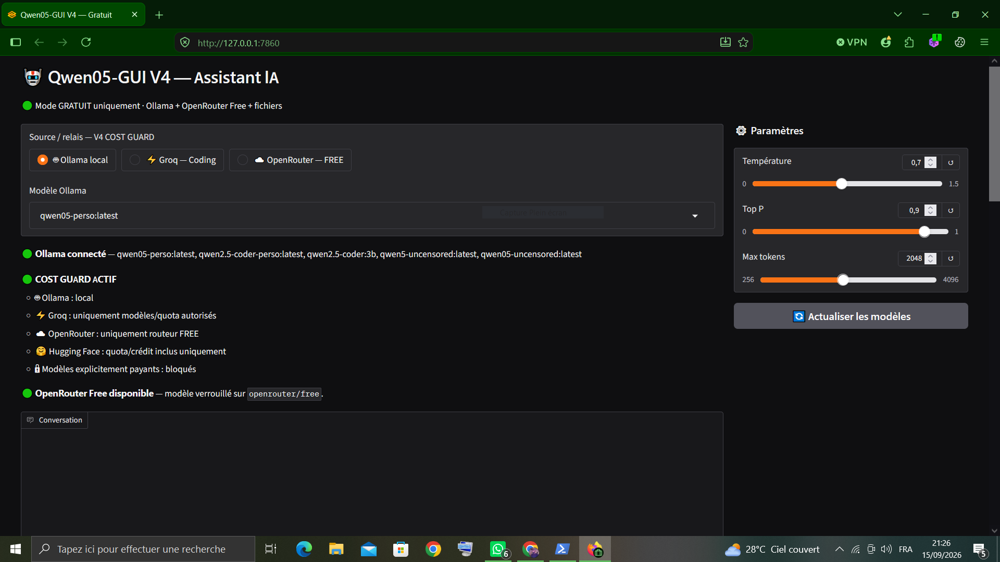
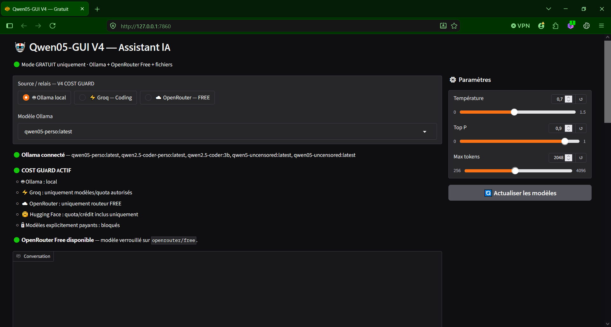
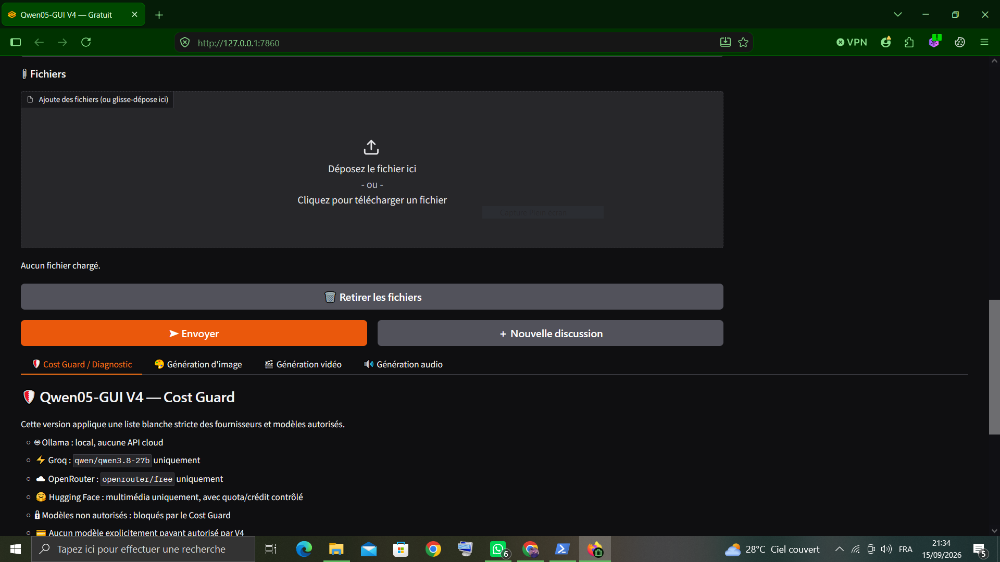
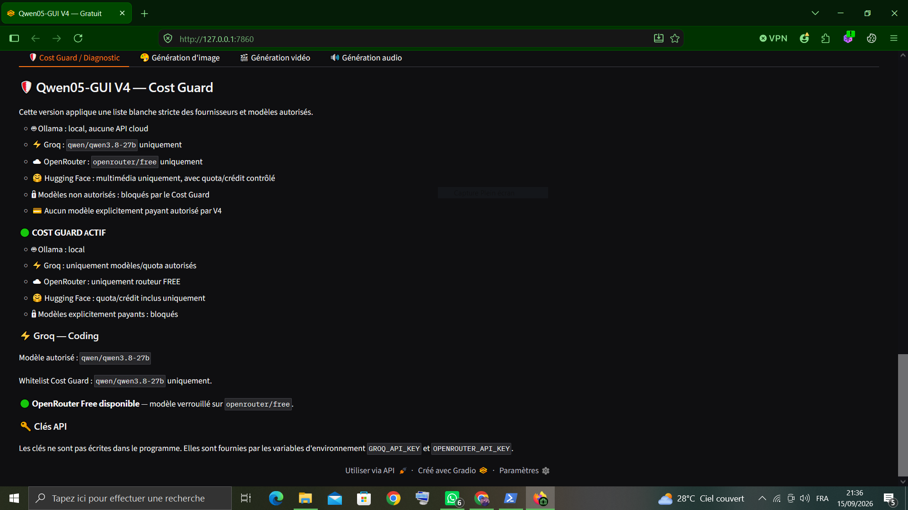

# Qwen05-GUI

<p align="center">
  <strong>Local & Cloud AI Assistant GUI</strong>
</p>

<p align="center">
  A desktop-friendly AI interface powered by Ollama, Qwen, Groq, OpenRouter and Hugging Face.
</p>

---

## 🖥️ Preview

<p align="center">
  
</p>

<p align="center">
  
</p>

<p align="center">
  
</p>

<p align="center">
  
</p>

---

## ✨ Overview

**Qwen05-GUI** is a local-first AI assistant interface designed to bring multiple AI capabilities together in a simple Gradio application.

The project combines **local AI models** running through Ollama with selected **cloud AI services**, while keeping provider configuration and potential costs under control.

The goal is to provide a practical environment for:

- 💬 AI conversations
- 🧠 Local Qwen models
- 💻 Coding assistance
- ☁️ Cloud AI providers
- 🎨 Image generation
- 📁 File analysis
- ⚡ Streaming responses
- ⚙️ Model and generation parameters

---

## 🚀 Features

### 🧠 Local AI — Ollama

Run AI models locally on your own computer through Ollama.

Benefits:

- Local inference
- No cloud API required for local models
- Greater privacy
- Works offline for supported features
- Easy model switching

Example local models include:

- Qwen
- Qwen Coder
- Other models supported by Ollama

---

### 💻 Coding Assistant

Qwen Coder can be used for programming-related tasks such as:

- Python
- JavaScript
- HTML
- CSS
- JSON
- YAML
- PowerShell
- Batch
- SQL
- Configuration files

Loaded source files can also be sent directly to the AI for analysis.

---

### ☁️ Cloud AI

Qwen05-GUI can connect to cloud providers when an API key is configured.

Supported integrations include:

- Groq
- OpenRouter
- Hugging Face

Cloud services are kept separate from local Ollama models.

This makes it possible to use local AI when possible and cloud AI when additional capabilities are required.

---

### 🎨 Hugging Face

Hugging Face is integrated for AI media capabilities.

The project can use Hugging Face models for supported generation tasks, including image generation.

Example model:

```text
black-forest-labs/FLUX.1-schnell
